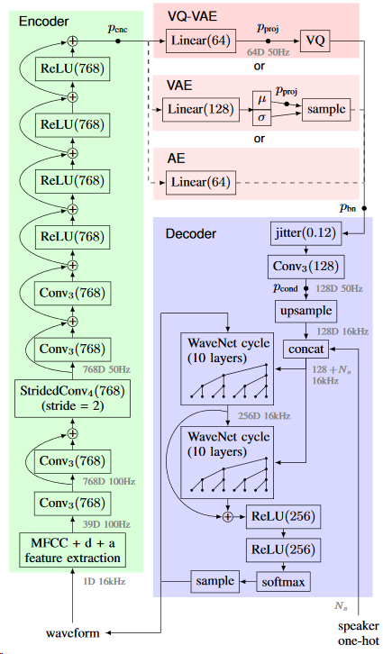
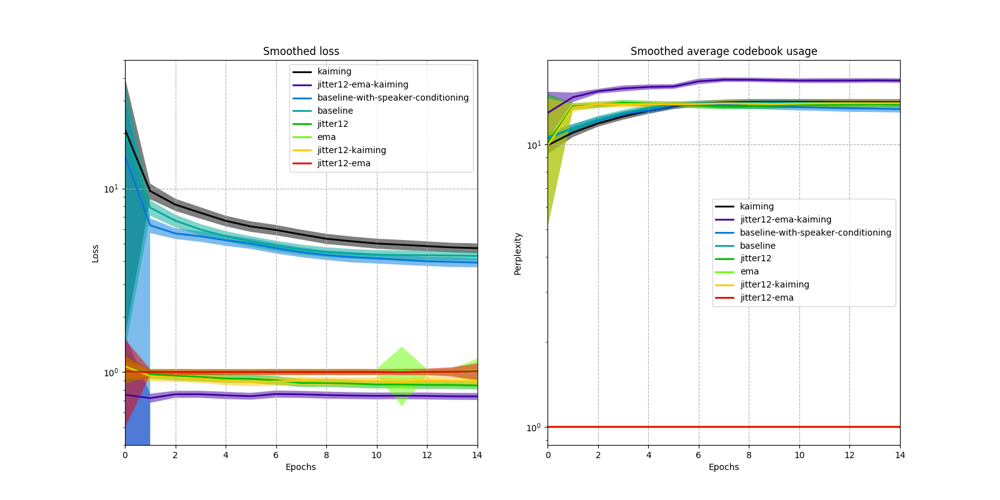
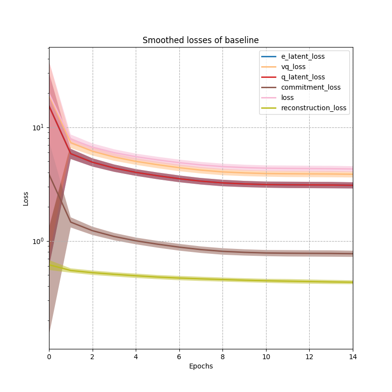
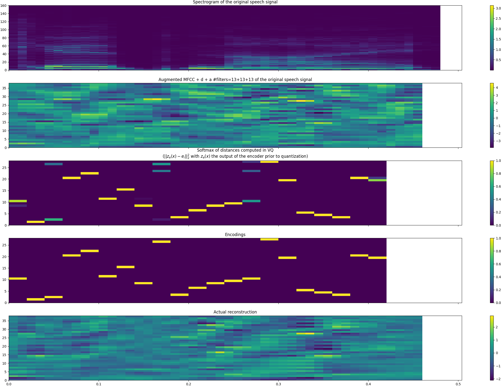
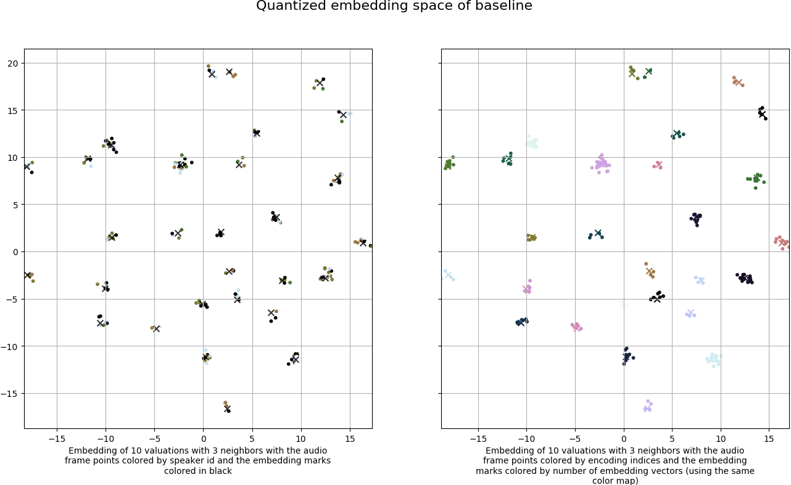

# Overview

PyTorch implementation of VQ-VAE + WaveNet by [Chorowski et al., 2019] and VQ-VAE on speech signals by [van den Oord et al., 2017].

The WaveNet [van den Oord et al., 2016] implementation is from [r9y9/wavenet_vocoder]. The VQ [van den Oord et al., 2016] implementation is inspired from [zalandoresearch/pytorch-vq-vae] and [deepmind/sonnet].

# Installation

It requires python3, python3-pip and the packages listed in [requirements.txt](requirements.txt).

To install the required packages:
```bash
pip3 install -r requirements.txt
```

# Examples of usage

First, move to the source directory:
```bash
cd src
```

```bash
python3 main.py --help
```

Output:
```
usage: main.py [-h] [--summary [SUMMARY]] [--export_to_features]
               [--experiments_configuration_path [EXPERIMENTS_CONFIGURATION_PATH]]
               [--experiments_path [EXPERIMENTS_PATH]]
               [--plot_experiments_losses] [--evaluate]
               [--compute_dataset_stats]

optional arguments:
  -h, --help            show this help message and exit
  --summary [SUMMARY]   The summary of the model based of a specified
                        configuration file (default: None)
  --export_to_features  Export the VCTK dataset files to features (default:
                        False)
  --experiments_configuration_path [EXPERIMENTS_CONFIGURATION_PATH]
                        The path of the experiments configuration file
                        (default: ../configurations/experiments.json)
  --experiments_path [EXPERIMENTS_PATH]
                        The path of the experiments ouput directory (default:
                        ../experiments)
  --plot_experiments_losses
                        Plot the losses of the experiments based of the
                        specified file in --experiments_configuration_path
                        option (default: False)
  --evaluate            Evaluate the model (default: False)
  --compute_dataset_stats
                        Compute the mean and the std of the VCTK dataset
                        (default: False)
```

First, we need to download the dataset (only VCTK is supported for now) and compute the MFCC features:
```bash
python3 main.py --export_to_features
```

Then, we have to create an experiments file (e.g., `../configurations/experiments_example.json`).
Example of experiment file:
```json
{
    "experiments_path": "../experiments",
    "results_path": "../results",
    "configuration_path": "../configurations/vctk_features.yaml",
    "seed": 1234,
    "experiments": {    
        "baseline": {
            "num_epochs": 15,
            "batch_size": 2,
            "num_embeddings": 29,
            "use_device": "cuda:1",
            "normalize": true
        }
    }
}
```
The parameters in the experiment will override the corresponding parameters from `vctk_features.yaml`.

Thus, we can run the experiment(s) specified in the previous file:
```bash
python3 main.py --experiments_configuration_path ../configurations/experiments_example.json
```

Finally, we can plot the training evolution:
```
python3 main.py --plot_experiments_losses
```

# Architectures

## VQ-VAE-Speech encoder + Deconv decoder

For now only this architecture was used in our experiments to decrease the training time necessary to train a WaveNet.

[vq_vae_speech](src/vq_vae_speech) for the encoder and [vq_vae_features](src/vq_vae_features) for the deconv decoder:


This figure describes the layers of the VQ-VAE model we have used. All convolution layers are in 1D dimension. The light orange color represents the convolutional part, whereas the dark orange represents the ReLU activation in the encoder. The two envelopes represent residual stacks. The purple arrows represents residual connections. The purple blocks are the embedding vectors. The pink layer represents the time-jitter regularization [Chorowski et al., 2019]. The light blue color represents the convolutional part, whereas the dark blue represents the ReLU activation in the decoder. The three pictures are view examples of respectively speech signal in waveform, MFCC features and log filterbank features.

## VQ-VAE-Speech encoder + WaveNet decoder

[vq_vae_speech](src/vq_vae_speech) for the encoder and [vq_vae_wavenet](src/vq_vae_wavenet) for the WaveNet decoder. Figure from [Chorowski et al., 2019]:


# Results

## VQ-VAE-Speech encoder + Deconv decoder

### Training



This figure shows the training evolution of the VQ-VAE model using two metrics: the loss values (the lower the better), and the perplexity, which is the average codebook usage. The model was trained during 15 epochs using the architecture described in Section `VQ-VAE-Speech encoder + Deconv decoder`. We used 29 vectors of dim 64 as the VQ space. All experiments have been setted with a seed of 1234 for reproducibility. We tried several variants of the training: the kaiming normal (also known as He initialization) [He, K et al., 2015], the VQ-EMA [Roy et al., 2018], the jitter layer proposed in [Chorowski et al., 2019].



### Evaluation

#### Comparaison plots



#### Embedding plots

The embedding are computed using [lmcinnes/umap] that is a dimension reduction technique that searches for a low dimensional projection of the data that has the closest possible equivalent "fuzzy" topological structure.


Left: the audio frames after quantization (points colored by speaker id) and the encoding indices (black marks) chosen by the distances computation.
Right: the audio frames after quantization (points colored by encoding indices) and the encoding indices (marks using the same coloration).
The number of point is the time size of the MFCC features (divided by two because of the downsampling in the encoder) times the number of vectors times the batch size. The number of marks is the number of embedding vectors (i.e., the tokens).
The right embedding plot contains cluster of the same color (the points are normally superposed, here we used a small jitter for visualization purpose), with respective mark on top of them, meaning that the distances between the embedding vectors and the data frames are correctly reduced, as expected.

# References

* [Chorowski et al., 2019] [Jan Chorowski, Ron J. Weiss, Samy Bengio, and Aaron van den Oord. Unsupervised speech representation learning using WaveNet autoencoders. arXiv e-prints, page arXiv:1901.08810, 01 2019](https://arxiv.org/abs/1901.08810).

* [van den Oord et al., 2016] [A. van den Oord, S. Dieleman, H. Zen, K. Simonyan, O. Vinyals, A. Graves, N. Kalchbrenner, A. Senior, and K. Kavukcuoglu, “WaveNet: A generative model for raw audio,” arXiv preprint arXiv:1609.03499, 2016](https://arxiv.org/abs/1609.03499).

* [van den Oord et al., 2017] [van den Oord A., and Oriol Vinyals. "Neural discrete representation learning." Advances in Neural Information Processing Systems(NIPS). 2017](https://arxiv.org/abs/1711.00937).

* [Ping et al., 2018] [Ping, Wei & Peng, Kainan & Chen, Jitong. (2018). ClariNet: Parallel Wave Generation in End-to-End Text-to-Speech](https://github.com/ksw0306/ClariNet).

* [ksw0306/ClariNet] https://github.com/ksw0306/ClariNet.

* [Kim et al., 2018] [Kim, Sungwon & Lee, Sang-gil & Song, Jongyoon & Yoon, Sungroh. (2018). FloWaveNet : A Generative Flow for Raw Audio](https://arxiv.org/abs/1811.02155).

* [He, K et al., 2015] [He, K., Zhang, X., Ren, S and Sun, J. Deep Residual Learning for Image Recognition. arXiv e-prints arXiv:1502.01852](https://arxiv.org/abs/1512.03385).

* [Roy et al., 2018] [A. Roy, A. Vaswani, A. Neelakantan, and N. Parmar. Theory and experiments on vector quantized autoencoders.arXiv preprint arXiv:1805.11063, 2018](https://arxiv.org/abs/1805.11063).

* [ksw0306/FloWaveNet] https://github.com/ksw0306/FloWaveNet.

* [r9y9/wavenet_vocoder] https://github.com/r9y9/wavenet_vocoder.

* [zalandoresearch/pytorch-vq-vae] https://github.com/zalandoresearch/pytorch-vq-vae.

* [deepmind/sonnet] https://github.com/deepmind/sonnet/blob/master/sonnet/examples/vqvae_example.ipynb.

* [lmcinnes/umap] https://github.com/lmcinnes/umap
